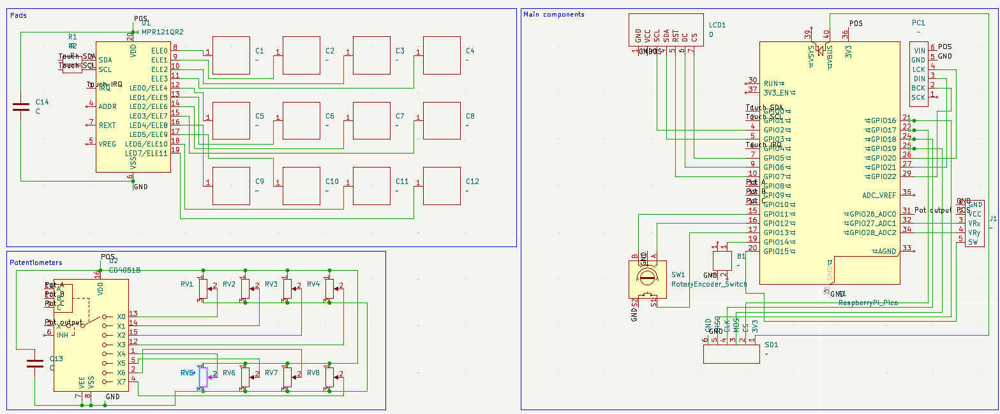
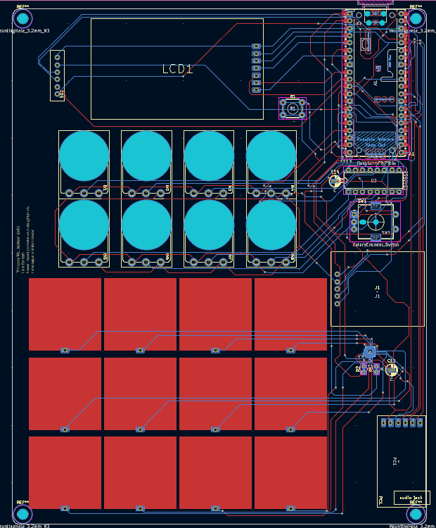
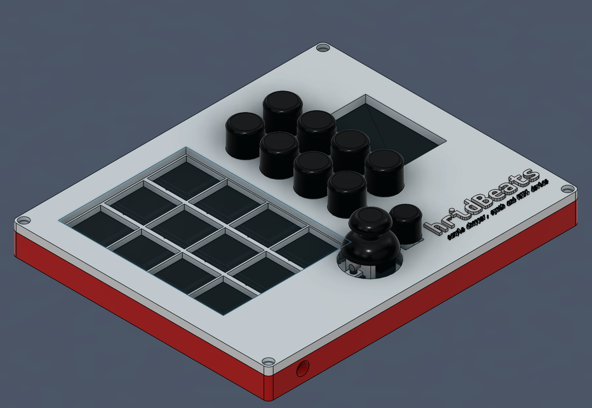

# hridBeats
hridBeats is an open-source sample chopper, synth, and MIDI controller based off the Raspberry Pi Pico. 

# Features

- 12 touchpads
- 8 potentiometers
- rotary encoder with a pushbutton
- joystick for mouse control
- TFT LCD 2.0" ST7789 display
- PCM5102A I2S DAC board for audio output
- SD card slot for loading songs/samples
- MIDI through USB
- Mini synth engine

# Pictures

|Schematic|PCB|Case|
|---|---|---|
||||